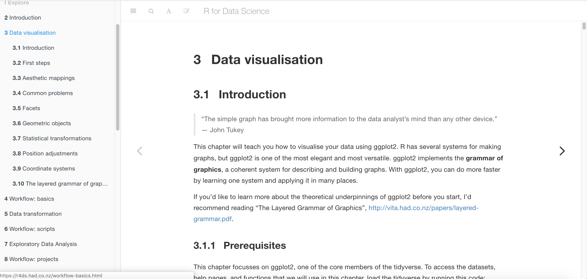
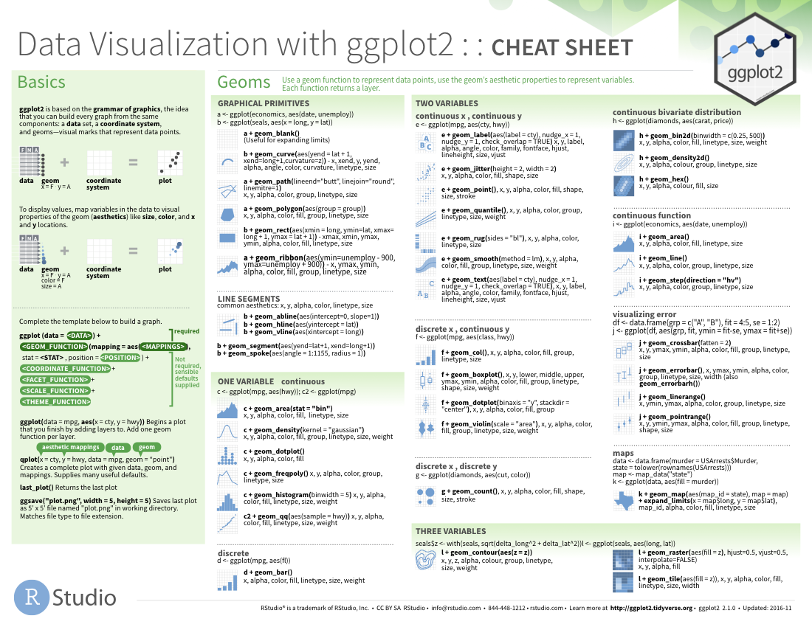

```{r setup, include=FALSE}
options(htmltools.dir.version = FALSE)
```

.pull-left[

]

.pull-right[

]

<br>

## [A Grammar of Graphics](https://vita.had.co.nz/papers/layered-grammar.pdf) by Hadley Wickham, RStudio

---

# Get Started

- [Link to Book](https://r4ds.had.co.nz/data-visualisation.html)



---

# Hello World

- Load tidyverse (ggplot2)

```{r eval=FALSE, tidy=FALSE}
install.packages("tidyverse")
library(tidyverse)
```


---
# mpg Data Frame

```{r, echo = FALSE}
knitr::kable(head(ggplot2::mpg), format = 'html')
```


---
# mpg Data Frame

```{r, echo = FALSE}
knitr::kable(head(ggplot2::mpg %>% select(displ, hwy)), format = 'html')
```

- `displ`: a car's engine size, in liters.

- `hwy`: a car's efficiency in miles per gallon. A car with low `hwy` consumes more fuel than a car with high `hwy`

---
# Creating a ggplot

```{r, eval=FALSE}
ggplot(data = mpg)
```

- `ggplot()` creates a coordinate system you can add layers to. 


---

background-image: url("images/blank-canvas.jpg")
background-size: cover

---
# Creating a ggplot

```{r, eval=FALSE}
ggplot(data = mpg) +
  geom_point()
```

- `geom_point()` adds a layer to your plot: points for a scatterplot

---
# Creating a ggplot

```{r, eval=FALSE}
ggplot(data = mpg) +
  geom_point(mapping = aes(x = displ, y = hwy))
```

- `mapping` argument is always paired with `aes()` and defines how variables in your dataset are mapped to visual properties.

- x and y arguments specify which variables to map to x and y-axes.

---
# 3.2.4 Exercises: #1, #4


```{r, echo = FALSE}
countdown::countdown(minutes = 5, seconds = 0)
```

---
# Aesthetics in Geoms

- An aesthetic is a visual property of the objects in your plot.

- For ex) Size, shape, or color of points

<br>

_The greatest value of a picture is when it forces us to notice what we never expected to see_ (John Tukey)

---
# Color Aesthetic in Geoms


```{r, echo = FALSE, fig.width=10,fig.height=5, warning=FALSE}
ggplot(data = mpg) +
  geom_point(mapping = aes(x = displ, y = hwy, color = class))
```

---
# Alpha Aesthetic in Geoms

```{r, echo = FALSE, fig.width=10,fig.height=5, warning=FALSE}
ggplot(data = mpg) +
  geom_point(mapping = aes(x = displ, y = hwy, alpha = class))
```
---
# Shape Aesthetic in Geoms

```{r, echo = FALSE, fig.width=10,fig.height=5, warning=FALSE}
ggplot(data = mpg) +
  geom_point(mapping = aes(x = displ, y = hwy, shape = class))
```
---
# Manual Aesthetics

```{r, echo = FALSE}
ggplot(data = mpg) +
  geom_point(mapping = aes(x = displ, y = hwy), color = "red")
```

- To set aesthetics manually, place it outside of `aes()`
---
# 3.3.1 Exercises: #1, #2, #6


```{r, echo = FALSE}
countdown::countdown(minutes = 5, seconds = 0)
```

---
# Common Problems: Demo


---
# Facets (Single Variable)

- To facet your plot by a single variable, use `facet_wrap()`

```{r, fig.width=9,fig.height=5}
ggplot(data = mpg) + 
  geom_point(mapping = aes(x = displ, y = hwy)) + 
  facet_wrap(~ class, nrow = 2)
```

---
# Facets (Multiple Variables)

- The formula should contain two variable names separated by a `~`.

```{r, fig.width=9,fig.height=5}
ggplot(data = mpg) + 
  geom_point(mapping = aes(x = displ, y = hwy)) + 
  facet_grid(drv ~ cyl)
```

---
# Facets

If you prefer to not facet in the rows or columns dimension, use a . instead of a variable name, e.g. + facet_grid(. ~ cyl).

```{r, fig.width=9,fig.height=5}
ggplot(data = mpg) + 
  geom_point(mapping = aes(x = displ, y = hwy)) + 
  facet_grid(. ~ cyl)
```

---
# 3.5.1 Exercises: #1, #2, #3


```{r, echo = FALSE}
countdown::countdown(minutes = 5, seconds = 0)
```

---
# Geometric Objects

- A geom is the geometrical object that a plot uses to represent data.

```{r, fig.width=10,fig.height=5}
ggplot(data = mpg) + 
  geom_point(mapping = aes(x = displ, y = hwy))

ggplot(data = mpg) + 
  geom_smooth(mapping = aes(x = displ, y = hwy))
```
---
# Cheatsheet

- The best way to get a comprehensive overview of the many available geoms is the [ggplot2 cheatsheet](http://rstudio.com/cheatsheets)



---
# Multiple Geometric Objects

- To display multiple geoms in the same plot, add multiple geom functions to ggplot():

```{r, fig.width=8,fig.height=4, warning=FALSE, message=FALSE}
ggplot(data = mpg) + 
  geom_point(mapping = aes(x = displ, y = hwy)) +
  geom_smooth(mapping = aes(x = displ, y = hwy))
```

---
# Reduce Duplication

```{r, fig.width=10,fig.height=5, warning=FALSE, message=FALSE}
ggplot(data = mpg, mapping = aes(x = displ, y = hwy)) + 
  geom_point() + 
  geom_smooth()
```

---
# 3.6.1 Exercises: #1, #2, #3


```{r, echo = FALSE}
countdown::countdown(minutes = 5, seconds = 0)
```

---
# 3.8 Position Adjustments

- Bars are automatically stacked

```{r, fig.width=9,fig.height=5}
ggplot(data = diamonds) + 
  geom_bar(mapping = aes(x = cut, fill = clarity))
```

---
# `position = "identity"`

- The default condition

---
# `position = "fill"`

- Works like stacking, but makes each set of stacked bars the same height. 
- This makes it easier to compare proportions across groups.

```{r, fig.width=9,fig.height=5}
ggplot(data = diamonds) + 
  geom_bar(mapping = aes(x = cut, fill = clarity), position = "fill")
```


---
# `position = "dodge"`

- Places overlapping objects directly beside one another. 
- This makes it easier to compare individual values.

```{r, fig.width=9,fig.height=5}
ggplot(data = diamonds) + 
  geom_bar(mapping = aes(x = cut, fill = clarity), position = "dodge")
```

---
# `position = "jitter"`

```{r, fig.width=9,fig.height=5}
ggplot(data = mpg) + 
  geom_point(mapping = aes(x = displ, y = hwy), position = "jitter")
```

- ggplot2 comes with a shorthand for `geom_point(position = "jitter")`: `geom_jitter()`.

---
# 3.8.1 Exercises: #1, #2, #3


```{r, echo = FALSE}
countdown::countdown(minutes = 5, seconds = 0)
```


---


## Contact: howardhowiebaik@gmail.com


